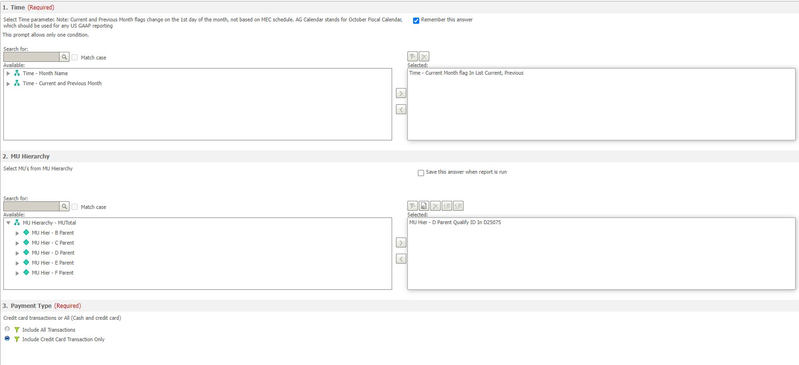

# Automating Finance
## Introduction
This is made up of two scripts that automate the process of downloading the required data from Incorta and Microstrategy from their respective scripts. This is intended for Keysight Technologies Employees only.

## Prerequisites
- Python 3.8 or higher (3.10.10 was used)
- Google Chrome
- Selenium 4.8
- webdriver_manager
- A valid Incorta and Microstrategy account

## Set Up Guide
This does not need to be followed all the way if you are knowledgeable in fulfilling the requirements but is usefull if it is not working on first use.

### Incorta

To be able for the script to download the files correctly, the following files in Incorta must be favorited:
1. MARCOM PO REPORT - PR Number Copy
2. Marcom_invoices

### Microstrategy

Make sure that before you make the report, that the selected fields for Time, MU Hierarchy and Payment Type are as shown in the image.

### The Other Prerequisites
These have to be downloaded, as they are the language where the instructions are written in, and completed in.

#### Python
There are multiple ways to download Python but the easiest way for Windows Devices is to download it from the [Microsoft Store](https://www.microsoft.com/store/productId/9NRWMJP3717K) . For macOS devices, the [official website](https://www.python.org/downloads/macos/) is good, just make sure that you download the latest release and follow the installation instructions.

#### Selenium
The latest version of Selenium that was used was 4.8. This is used to automate tasks in browsers like Google Chrome, Firefox, Edge, or Safari.

You can use Pip, which is a package manager that comes with Python. You can copy and paste the below in Windows PowerShell or Terminal for macOS:

`pip install selenium`

Once done, press enter, accept any agreements and wait for it to finish downloading.

#### webdriver_manager
This is a library that is used to get the drivers for Selenium so the tasks can be performed.

You can use Pip again, copy and paste the following:

`pip install webdriver-manager`

Press enter, accept any agreements and wait for it to finish downloading.

## Usage
Run the script for the data that you need with Python, you can do this by right clicking the script and then clicking open with, where you should be able to see Python.

You will need to enter the Login details for Incorta in the Python Shell and for Microstrategy, you have 2 minutes to login to your Keysight Account. From there, you can let the script do it's thing.

## Notes:
- if you do want to paste in the python terminal, do control + shift + v
- if you press control + c , you will force the script to end
- make sure you have no other files ending in .crdownload in you download location
- as of right now, microstrategy is not ready for use